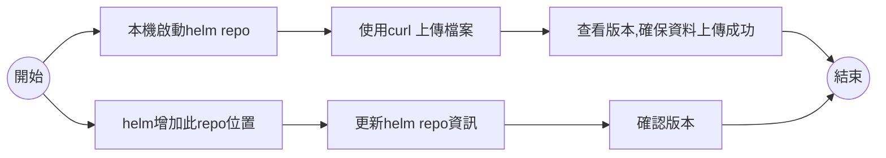

# chartmuseum 
## 流程

## 本機啟動helm repo
  - docker 版本啟動
  - 一般情況會有資料夾權限問題，所以需要開通最高權限
  - git bash
    - 使用需要在前面加上 winpty
    - 目錄需增加$(pwd)
```bat
-d 
docker run --rm -u 0 -it  -p 8080:8080 -e DEBUG=1 -e STORAGE=local -e STORAGE_LOCAL_ROOTDIR=/charts -v ./charts:/charts chartmuseum/chartmuseum:latest
```

## 查看版本
```bat
$  curl http://localhost:8080/api/charts
```

## 上傳檔案
```bat
$  curl --data-binary "@cm-demo-0.1.0.tgz" http://localhost:8080/api/charts
  % Total    % Received % Xferd  Average Speed   Time    Time     Time  Current
                                 Dload  Upload   Total   Spent    Left  Speed
  0     0    0     0    0     0      0      0 --:--:--  0:00:02 --:--:--     0curl: (6) Could not resolve host: curl
  % Total    % Received % Xferd  Average Speed   Time    Time     Time  Current
                                 Dload  Upload   Total   Spent    Left  Speed
100  210k  100    14  100  210k    564  8503k --:--:-- --:--:-- --:--:-- 8782k{"saved":true}

```

## 刪除上傳
```
$ curl -X DELETE http://localhost:8080/api/charts/cm-demo/0.1.0
  % Total    % Received % Xferd  Average Speed   Time    Time     Time  Current
                                 Dload  Upload   Total   Spent    Left  Speed
100    16  100    16    0     0   3949      0 --:--:-- --:--:-- --:--:--  4000{"deleted":true}
```


## 增加helm repo
```bat
$ helm repo add chartmuseum http://localhost:8080
```
## 查看repo 清單
```bat
$ helm repo list
NAME            URL
chartmuseum     http://localhost:8080
```
## 刪除repo
```bat
$ helm repo remove chartmuseum
"chartmuseum" has been removed from your repositories
```

## 更新repo 取得資料
```bat
$ helm repo update
Hang tight while we grab the latest from your chart repositories...
...Successfully got an update from the "chartmuseum" chart repository
Update Complete. ⎈Happy Helming!⎈
```

## 搜尋repo關鍵字
```bat
$ helm search repo chartmuseum
NAME                            CHART VERSION   APP VERSION     DESCRIPTION     
chartmuseum/redis-cluster       8.3.8           7.0.8           Redis(R) is an open source, scalable, distribut...


$ helm search repo demo
NAME                    CHART VERSION   APP VERSION     DESCRIPTION
chartmuseum/cm-demo     0.1.0           1.16.0          A Helm chart for Kubernetes
```

